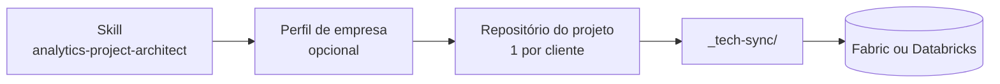
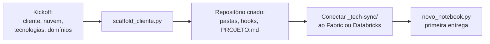
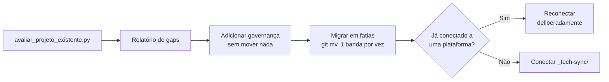

# Getting started

Uma skill do Claude Code que estrutura um projeto de engenharia de analytics — BI, datalake, ML — do kickoff ao handoff, com pastas padrão, um log vivo, hooks e scripts reais. Serve tanto para começar um projeto do zero quanto para reorganizar um projeto que já existe.

## Instalação (uma vez por máquina — funciona de primeira em qualquer projeto, inclusive no VS Code)

```
/plugin marketplace add andrerocha-zbra/skill-claude-engineering-analytics
/plugin install analytics-project-architect@analytics-engineering-harness --scope user
```

`--scope user` instala em **escopo de usuário** (global): fica disponível em qualquer projeto/workspace que você abrir depois nessa máquina, sem precisar rodar `/plugin install` de novo por projeto. Se o Claude Code abrir um prompt interativo perguntando o escopo (por exemplo, se você rodar sem `--scope`), escolha **"user"/"global"** — nunca "project" (esse instala só pro repositório atual) nem "local" (só pra você, só naquele repositório).

**Funciona igual dentro do VS Code.** A extensão oficial do Claude Code usa o mesmo painel/comandos `/plugin` (ou o diálogo "Manage plugins" da extensão) e grava no mesmo arquivo de configuração de usuário — não existe uma instalação separada "só pro VS Code". Depois de instalar, não precisa reiniciar o VS Code: só abrir uma sessão nova do Claude Code (ou rodar `/reload-plugins`, se a sessão já estiver aberta) pra carregar o plugin.

Confirme que instalou:

```
/plugin
```

→ aba "Installed" deve listar `analytics-project-architect`. No terminal, `claude plugin list --enabled` mostra o mesmo.

Os MCPs bundled no plugin (`fabric` e `powerbi-modeling-mcp`, ver `.mcp.json` da skill) ativam sozinhos junto com o plugin — sem passo extra. Exceção: `powerbi-modeling-mcp` roda um executável local específico da máquina (vem de uma extensão do VS Code) — ainda não existe nenhum projeto agora, então esse caminho só é resolvido depois de criar o primeiro projeto (`scaffold_cliente.py` já lembra disso no próprio output, "Próximos passos"). Se quiser resolver antes de ter um projeto, rode `detectar_powerbi_modeling_mcp.py --global` a partir de dentro do plugin instalado (`claude plugin list` mostra o caminho de instalação). O MCP `fabric` não precisa desse passo — autentica sozinho via OAuth no primeiro uso.

## Como as peças se encaixam



A skill é genérica e não muda entre projetos. O perfil de empresa (`company-profiles/`) é opcional e guarda só identidade — voz, design default — de quem está conduzindo os projetos. Cada cliente tem seu próprio repositório. Dentro dele, uma única pasta (`_tech-sync/`) se conecta à plataforma de dados; o resto do repositório — atas, regras de negócio, documentação — nunca é visto por ela.

## Duas jornadas

### Projeto novo



```bash
python plugins/analytics-project-architect/scripts/scaffold_cliente.py \
  --cliente nome-do-cliente --cloud fabric \
  --tecnologias powerbi,datalake --dominios dominio1,dominio2 \
  --destino ../nome-do-cliente-brain
```

Isso cria o repositório completo: árvore de pastas, `.claude/settings.json` com os hooks já configurados, `PROJETO.md`/`AGENTS.md`/`CLAUDE.md` preenchidos, e `datalake/_tech-sync/` pronto para a nuvem escolhida.

### Projeto existente



```bash
python plugins/analytics-project-architect/scripts/avaliar_projeto_existente.py \
  --projeto /caminho/do/projeto/existente --saida relatorio-gap.md
```

O script só lê — nunca move ou apaga nada no projeto avaliado. O relatório mapeia o que já existe contra a estrutura padrão e sugere próximos passos; qualquer migração de pasta é uma decisão deliberada, nunca automática. Detalhe do processo: `plugins/analytics-project-architect/references/09-refatorar-projeto-existente.md`.

## A estrutura de um projeto

```
<projeto>/
├── PROJETO.md                 # log vivo + manifesto
├── AGENTS.md / CLAUDE.md      # bootstrap
├── .claude/settings.json      # hooks
├── @client_context/           # regras de negócio, catálogo, design-system do cliente
├── apresentacoes/
├── reunioes/
├── powerbi/<dominio>/
├── datalake/
│   ├── _tech-sync/            # única pasta conectada à plataforma de dados
│   └── documentacao/
├── ml/
├── tasks/
├── historico/                 # decisões e arquitetura supersedidas
└── backup/
```

Detalhe completo, incluindo regras de crescimento: `plugins/analytics-project-architect/references/01-estrutura-e-nomenclatura.md`.

## Onde cada coisa mora neste repositório

| Pasta | Conteúdo |
|---|---|
| `plugins/analytics-project-architect/` | A skill — `SKILL.md`, `references/`, `templates/`, `scripts/`, `hooks/` |
| `company-profiles/` | Identidade opcional de quem conduz os projetos |
| `docs/METODO.md` | O método por trás da skill, em prosa |

## Próximo passo

Para usar a skill: instale com `/plugin marketplace add` (ver `README.md`) e peça para iniciar ou avaliar um projeto — a skill pergunta o que faltar.

Para entender o método a fundo antes de usar: `docs/METODO.md`, depois `plugins/analytics-project-architect/SKILL.md`.
